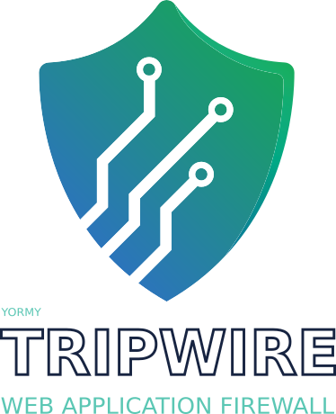

# Tripwire - Web Appplication Firewall



::: tip Definition One
a wire stretched close to the ground, working a trap, explosion, or alarm when disturbed and serving to detect or prevent people or animals entering an area.
:::

::: tip Definition Two
a comparatively weak military force employed as a first line of defence, engagement with which will trigger the intervention of stronger forces.
:::

## Goal
To stop attackers from reaching your site and to block them as soon as possible
Tripwire is an easy yet comprehensive and extendable way to add a security layer around laravel.
All in order to prevent hackers getting into your system and frustrates the heck out of them while trying

::: danger Limitation
Tripwire is not intended to validate or sanitize input, and also no substitute for proper coding. Your site should be well protected against different types of attack without tripwire in the first place. Tripwire will just add another layer or protection
:::

## Overview
Tripwire is a package designed to early catch attempts to hack your site and stop those people right in their tracks and block repeated attempts.
It is designed to sit in front of every request (or the ones you specify) to listen to what is coming in and determine if that is suspicious or not.
Suspicious requests (ie Sqli, xss etc) will be logged with many details about the request for inspection. 
When the user attempts multiple times the ip/user will be automatically blocked from sending any request and the user will be presented a fuck-off screen.

Features that tripwire include:
* Automatically screen requests and prevent malicious ones
* Automatically temporarily block users due to malicious requests, all site access for this user/ip is blocked
* Increasing the block time when multiple blocks have been registered, until the ip/user is blocked permanent
* Allow a user to remove their blocks on ip/user with a special assigned url. (for developers/security researchers/pentesters)
* Group different types of checkers (```wires```), for easy usage in middleware groups
* Events dispatching on suspicious requests and on blocks added so you can listen and take additional actions
* Notifications on blocking to email and/or slack
* Extensive configuration on the level of severity (```attackScore```) of each malicious detection
* Extensive configure how to respond on a malicious detection (silent, exception, abort, view, json, redirect)
* Extensive log functions so you can see exactly what/why/why a certain wire was triggered.
* Debug mode to add mode details to the logs
* Training mode to fully function, register and create blocks, without actually blocking the user. This is useful for initial installation to see if there are false positives
* Determine the specific requests that were made that led to a certain block
* Configure exactly how a block should respond. At what malicious sum score level (```punishScore```), and how to respond (silent, exception, view, json, redirect)
* Persistent blocks, prevent blocks from being removed.

<!--@include: ../guide/basic/frontend.md-->
